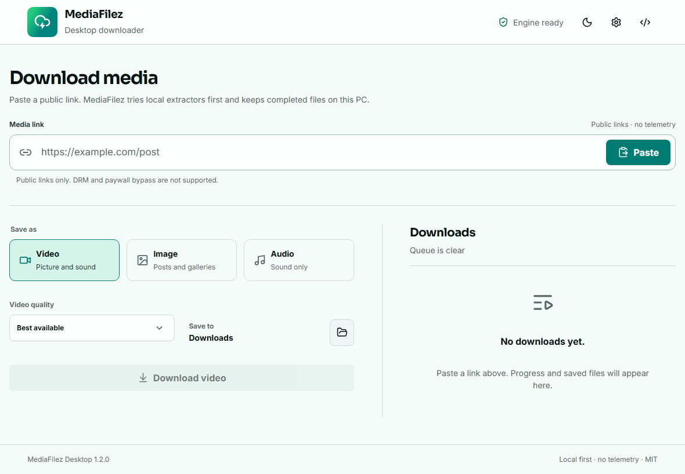

# MediaFilez Desktop

[](https://github.com/RlxChap2/mediafilez-desktop/actions/workflows/build.yml)

MediaFilez Desktop saves public videos, images, galleries, and audio on Windows. Paste a link, choose one of three output modes, and let the app work through a local-first resolver chain. The queue can run four jobs at once, keeps history on the device, and never overwrites an existing file.



Windows 10 and 11 are the current release targets. The Tauri and Rust foundation is portable, but managed tool installation and release packaging for macOS and Linux are still in development.

## What it handles

- Video, image or gallery, and audio downloads.
- Muted video lives under the advanced Video options, so the main mode switch stays at three choices.
- Best available quality or a video cap from 2160p to 360p.
- Native audio, MP3, M4A, Opus, and WAV output, with optional bitrate selection.
- Four simultaneous jobs plus configurable HLS and DASH fragment concurrency.
- Download progress, speed, ETA, cancellation, retry, and local history.
- A native output-folder picker. Existing files are never overwritten.
- Optional Firefox/browser profiles and Netscape `cookies.txt` files for media the user is authorized to access.
- Browser impersonation retry for sites that reject a normal media request.
- An ordered pool of self-hosted or owner-approved Cobalt v11 endpoints.
- Automatic, checksum-verified installation of yt-dlp, gallery-dl, Deno, and Windows FFmpeg.
- Pinterest and Instagram image posts prefer gallery-dl before the general extractors.
- An experimental Instagram embed fallback. It is off by default and never receives cookies or API tokens.
- Light and dark themes with responsive desktop and tablet layouts.
- No telemetry.
- Signed in-app updates and update checks for managed download tools.

The desktop app checks the signed GitHub release feed at startup. When a newer version is available, it shows the installed and available versions and waits for the user to choose **Update now** or **Later**. Updates are installed only after Tauri verifies the release signature.

Site support follows the installed yt-dlp and gallery-dl extractors, plus direct media and public page metadata. Unlisted sites may work through generic extraction, but no downloader can promise every site. MediaFilez Desktop does not bypass DRM, paywalls, permissions, or access controls.

## How links are resolved

The order changes with the selected mode and link type. A normal video job follows this sequence:

| Order | Resolver | Role |
| --- | --- | --- |
| 1 | Direct stream | Saves a public media file without launching another process |
| 2 | yt-dlp | Handles supported sites locally, including HLS and DASH streams |
| 3 | Authorized Cobalt pool | Tries up to eight configured Cobalt v11 endpoints in order |
| 4 | Community Cobalt | Legacy opt-in fallback. Use only servers whose owners permit it |
| 5 | gallery-dl | Handles supported image, gallery, and video pages |
| 6 | Instagram embed | Optional Instagram-only fallback with strict redirect checks |
| 7 | Page media scan | Searches public metadata and media elements for a direct source |

Image jobs from Pinterest or Instagram start with gallery-dl. Audio jobs skip image-only resolvers. A direct URL is accepted only when its type matches the requested mode. Every completed file must be non-empty, use a safe filename, and pass a content check that rejects HTML, JSON, XML, and error pages.

Managed tools come from publisher release URLs and are installed only after their published SHA-256 matches. gallery-dl is installed on demand, so users do not need to remember a separate setup command. Deno handles JavaScript challenges required by current YouTube extractors. MediaFilez Desktop can use tools found on `PATH`, but marks those copies as system-provided rather than publisher-verified.

### Cobalt endpoints

Open **Settings → Show advanced options → Authorized Cobalt pool** and enter one HTTPS endpoint per line. MediaFilez Desktop tries the pool in order and stops on the first valid media response. Cobalt no longer offers a general public hosted API, so the normal setup is a self-hosted endpoint or one whose owner gave you access. Authentication can use `Api-Key` or `Bearer`; the token stays in memory and is not written to settings.

## Links that require sign-in

Reddit, Instagram, X, YouTube, and other sites may require the same signed-in session used in a browser. Open **Settings → Show advanced options → Site sign-in**, then choose one of these methods:

1. Use a Firefox session. Select the profile when more than one profile exists.
2. Select a fresh Netscape-format `cookies.txt` file exported from a browser session.

Firefox is the most reliable direct-browser option on Windows. Chromium browsers can lock their cookie database while running, and newer Chrome builds can prevent third-party decryption through Windows DPAPI. MediaFilez Desktop does not terminate browsers or weaken those protections. Close every Chromium window before retrying, or use Firefox or `cookies.txt` instead.

An HTTP 403 response means the site rejected the media request. MediaFilez Desktop retries yt-dlp with browser-compatible networking. If that fails, refresh the signed-in session, export new cookies, or try later. Private posts still require permission. Some YouTube formats need a site-issued PO token that the app cannot create for the user.

## Privacy and security

- Downloads stay local unless an API fallback is enabled.
- API tokens remain in memory and are not written to `settings.json`.
- Browser-cookie access is opt-in and is passed only to local extractor processes. A selected cookie file takes precedence over direct browser access.
- Media URLs containing embedded credentials, local hostnames, or private IP ranges are rejected.
- Direct and fallback downloads reject executable files, shortcuts, HTML error pages, and unsafe redirects.
- The Instagram embed fallback accepts only canonical public Instagram post routes and Instagram CDN media hosts. It never receives session cookies or Cobalt credentials.
- The Tauri window uses a restrictive Content Security Policy and a small capability set.

Security reports should follow the private process in [SECURITY.md](SECURITY.md).

## Download and verify a release

Windows builds are published on the [Releases page](https://github.com/RlxChap2/mediafilez-desktop/releases). Each release includes `SHA256SUMS.txt` and displays the same checksums in its release notes. Signed updater builds also include the updater manifest and signature.

Compare a downloaded file with the published checksum:

```powershell
Get-FileHash '.\MediaFilez Desktop.exe' -Algorithm SHA256
Get-Content .\SHA256SUMS.txt
```

The repository also includes a verification helper:

```powershell
.\scripts\verify-release.ps1 -Manifest .\SHA256SUMS.txt -File '.\MediaFilez Desktop.exe'
```

GitHub build provenance can be checked with the GitHub CLI:

```powershell
gh attestation verify '.\MediaFilez Desktop.exe' --repo RlxChap2/mediafilez-desktop
```

A checksum confirms file identity, while the attestation links the file to this repository's GitHub Actions workflow. Windows publisher reputation is separate: releases need a publicly trusted Authenticode certificate, or Microsoft Store signing for an MSIX package, to identify the publisher to SmartScreen. A self-signed certificate does not provide that reputation.

## Build from source

Requirements:

- Node.js 22.13 or newer; CI uses Node.js 24.
- pnpm 11.5.1.
- Stable Rust.
- Microsoft C++ Build Tools and WebView2 on Windows.

```powershell
pnpm install --frozen-lockfile
pnpm tauri dev
pnpm tauri build
```

Run the same core checks used in CI:

```powershell
pnpm version:check
pnpm test
pnpm test:smoke
pnpm build
pnpm audit --prod

Set-Location src-tauri
cargo fmt --check
cargo clippy --all-targets --all-features -- -D warnings
cargo test
```

Three network integration tests are ignored by default because they download real files. Run them explicitly when that network activity is acceptable:

```powershell
Set-Location src-tauri
cargo test -- --ignored
```

## Publishing a release

The version command updates `package.json`, Tauri configuration, `Cargo.toml`, and the internal Rust package entry in `Cargo.lock` together:

```powershell
pnpm version:set 0.2.0
pnpm version:check
```

Commit the version change, then create and push a matching annotated tag:

```powershell
git add package.json src-tauri/Cargo.toml src-tauri/Cargo.lock src-tauri/tauri.conf.json
git commit -m "release: v0.2.0"
git tag -a v0.2.0 -m "MediaFilez Desktop v0.2.0"
git push origin main
git push origin v0.2.0
```

The release workflow checks the version and tag before starting tests or the Windows build. A valid tag triggers tests, dependency audits, the Windows build, configured signatures, SHA-256 generation, provenance attestation, and GitHub Release publication. A manual workflow run builds downloadable CI artifacts without publishing a release.

Updater signing uses the `TAURI_SIGNING_PRIVATE_KEY` and optional `TAURI_SIGNING_PRIVATE_KEY_PASSWORD` repository secrets. Windows Authenticode signing uses a base64-encoded PFX in `WINDOWS_CERTIFICATE` and its password in `WINDOWS_CERTIFICATE_PASSWORD`. Private keys and certificates must never be committed to the repository.

## Project layout

```text
src/app/                     App state and composition
src/components/              Shared layout and UI controls
src/features/downloads/      Download form, setup status, and history
src/features/settings/       Settings dialog
src/features/updates/        Signed update prompt
src/styles/                  Fonts and application styles
src/styles/tokens.css        Shared MediaFilez design tokens
docs/design.md               Interface rules and component states
docs/provider-notes.md       Provider contracts and fallback decisions
src-tauri/src/downloader.rs  Queue, provider chain, validation, and cancellation
src-tauri/src/providers/     Small adapters for each download engine
src-tauri/src/security.rs    URL and filename policy
src-tauri/src/tools.rs       Managed tool discovery, install, update, and SHA-256 checks
scripts/version.mjs          Version synchronization and release-tag check
tests/ui-smoke.mjs           Desktop and responsive Playwright smoke test
```

## Contributing

Bug reports and focused pull requests are welcome. See [CONTRIBUTING.md](CONTRIBUTING.md) for the local checks and contribution guidelines.

## Legal

Download only material that may legally be saved. Website terms and copyright law still apply. MediaFilez Desktop does not bypass DRM or paywalls.

## License

MediaFilez Desktop is released under the [MIT License](LICENSE). Managed external tools retain their own licenses; see [THIRD_PARTY_NOTICES.md](THIRD_PARTY_NOTICES.md).
